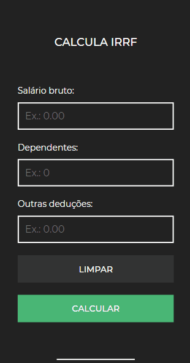

<h1 align="center">
  Calcula IRRF
</h1>

<h4 align="center">
  Aplicação que calcula o valor referente ao pagamento da dedução do IRRF, de um contribuinte
</h4>

<p align="center">
  &nbsp
  &nbsp
  
</p>

<br>

<p align="center">
  <a href="#tecnologias">Tecnologias</a>&nbsp;&nbsp;&nbsp; |&nbsp;&nbsp;&nbsp;
  <a href="#instruções">Instruções</a>&nbsp;&nbsp;&nbsp; |&nbsp;&nbsp;&nbsp;
  <a href="#licença">Licença</a>
</p>

<br>

<p align="center">
  
  <br><br>
</p>

## Tecnologias

**IDE**

  - VS Code.

**UI Design**

  - Adobe XD.

**Front-End**

  - HTML;
  - CSS / [SMACSS](http://smacss.com/) (Scalable and Modular Architecture for CSS);
  - JavaScript.

## Instruções

Há duas formas para poder utilizar a aplicação:

**Clonando através do console**

  - Primeiramente, instale o [Git](https://git-scm.com) em seu computador;

  - Após a instalação, abra o **GitBash** a partir do diretório que receberá o clone;

  - E por fim, digite o seguinte comando:

```bash
$ git clone https://github.com/JesseLopesDev/CalculaIRRF.git
```

**Baixando através do GitHub**

  - Clique na opção "**tag**", próximo as opções "branch" e "master";

  - E então, faça o download da versão mais recente.

## Licença

Este projeto está sob a licença do **MIT**. Acesse o arquivo [LICENSE](https://github.com/JesseLopesDev/CalculaIRRF/blob/master/LICENSE) para obter mais informações.

Made by [Jesse Lopes](https://github.com/JesseLopesDev). Follow me on [LinkedIn](https://www.linkedin.com/in/jess%C3%A9-lopes-ribeiro-050aa1170/).